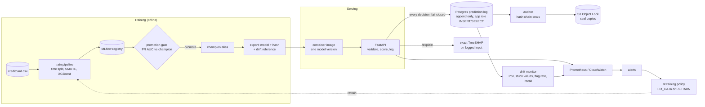
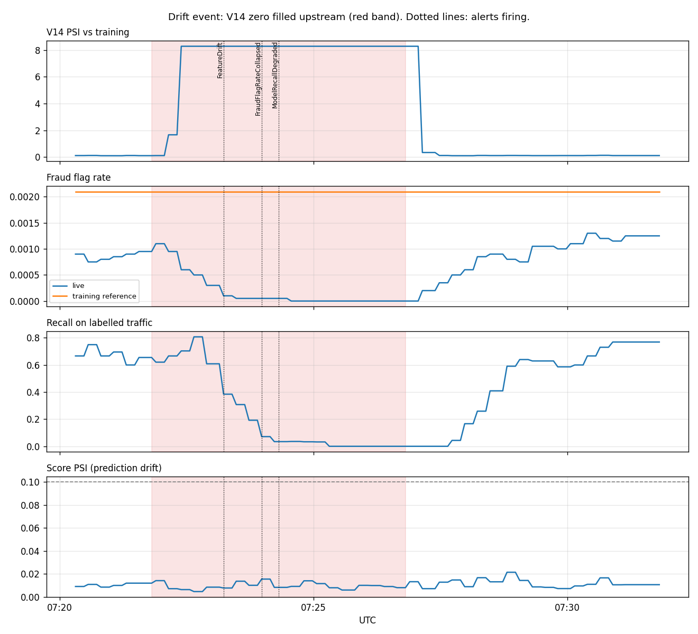

# Fraud Detection MLOps Platform

The full production lifecycle around an XGBoost card fraud model: reproducible training with a
model registry and promotion gate, a containerised inference service, monitoring with drift
detection and alerting, a tamper evident audit trail with per decision explanations, a written
retraining policy that runs as code, and Terraform that deploys it all to AWS.

The model itself is the existing [PayGuard](https://github.com/RidhanPar/payguard-ai-fraud-detection)
XGBoost model. This project is everything around it. Every number below comes from a real run,
with the raw output committed next to it.

## Headline numbers

| What | Result | Evidence |
|---|---|---|
| Model on a time ordered holdout (last 20% of transactions, 74 frauds) | PR AUC **0.776**, ROC AUC 0.963, recall 0.70 at precision 0.95 | MLflow run, [params.yaml](params.yaml) |
| Promotion gate | rejected a candidate with **higher** ROC AUC (0.974) but lower PR AUC | [Phase 1](#1-registry-reproducible-training-and-the-promotion-gate) |
| Serving parity | container matches the registry model on all 56,746 holdout rows (max difference 4e-9) | [Phase 2](#2-serving) |
| Latency, one replica (2 CPU), local | p50 6.5 ms, ~275 req/s before queueing | [docs/LOAD_TEST.md](docs/LOAD_TEST.md) |
| Upstream fault (V14 zero filled) | feature drift alert at +85 s, flag rate collapse +130 s, recall decay +150 s; **prediction drift never fired** | [docs/drift_event](docs/drift_event/DRIFT_EVENT.md) |
| Same recall alert, two causes | V14 outage → **FIX_DATA**; fraudster evasion → **RETRAIN_NOW** | [docs/RETRAINING_POLICY.md](docs/RETRAINING_POLICY.md) |
| Tamper test | an admin who disabled triggers and forged a row hash was caught by the seal chain | [docs/AUDIT.md](docs/AUDIT.md) |
| AWS deployment | deployed with Terraform (56 resources), drift alarms fired on CloudWatch, zero downtime rolling deploy (19,076 requests, 0 errors), then destroyed | [docs/AWS.md](docs/AWS.md) |

Every problem hit while building it, and how it was solved: [docs/ISSUES_AND_FIXES.md](docs/ISSUES_AND_FIXES.md).

A note on the model's headline figure. PayGuard was described as 0.999 ROC AUC. That does not
reproduce on any held out split: a random 80/20 split gives 0.965, the time ordered split
0.963, and only scoring the training data gives 1.000. The figures above are the honest ones.

## Architecture



Locally the whole stack runs in docker compose with Prometheus, Alertmanager and Grafana. On AWS
the same image runs on ECS Fargate behind a load balancer, with RDS for the log, S3 Object Lock
for seal copies and CloudWatch alarms in place of Prometheus rules.

## 1. Registry, reproducible training and the promotion gate

`python -m fraud_mlops.train` is the only way a model is made. Every run logs its parameters,
the SHA-256 of the data file, the git commit and whether the tree had uncommitted edits, then
registers a new version in MLflow.

- **Time ordered split** (60% train, 20% validation for the threshold, 20% holdout). In
  production a model always scores transactions newer than its training data.
- **`Time` replaced by hour of day.** Raw `Time` is seconds since the dataset started, which a
  live transaction does not have.
- **The gate** re-scores the current champion on the same holdout and promotes the candidate
  only if PR AUC improves by at least 0.005 without losing more than 2 points of recall. A paired
  bootstrap interval for the difference is logged with every comparison.

| Version | Change | ROC AUC | PR AUC | Gate |
|---|---|---|---|---|
| v1 | tuned PayGuard settings | 0.963 | 0.776 | promoted |
| v2 | 20 trees, depth 2 | **0.974** | 0.739 | rejected |
| v3 | identical rerun of v1 | 0.963 | 0.776 | rejected, metrics identical |

v2 is the lesson: with 0.17% fraud, ROC AUC is flattered by easy negatives, so a gate on ROC AUC
would have shipped a worse model. v3 is the proof of reproducibility.

## 2. Serving

FastAPI in a container with the exported model baked in (one image, one model version; rollback
is redeploying the previous tag). The model file's SHA-256 is checked **before** it is unpickled.

- **Strict validation.** Missing, renamed, extra, string typed, NaN, infinite and out of range
  values are rejected with 422, and errors name the field without echoing the value. This found
  a real bug: FastAPI's default handler returned 500 on NaN because it echoed the input.
- `POST /predict`, `POST /predict/batch` (up to 1,000 rows), `/health`, `/ready`, `/model`.
- **Image:** 801 MB after switching to the CPU only XGBoost wheel (from 1.97 GB).

Local load test, one replica with 2 CPUs, generator in its own container:

| Scenario | Throughput | p50 | p99 |
|---|---|---|---|
| 1 client | 147 req/s | 6.5 ms | 11 ms |
| 8 clients | 277 req/s | 27 ms | 55 ms |
| 64 clients | 269 req/s | 209 ms | 470 ms |
| batches of 1,000 | 29,510 rows/s | 63 ms | 123 ms |

Two measurement pitfalls were found and fixed along the way: `localhost` added 40 ms per request
on Docker Desktop for Windows, and the first load generator, not the service, was the bottleneck.

## 3. Monitoring, drift and alerting

The API exposes Prometheus metrics (latency, throughput, errors, rejected inputs by field, score
distribution, model version). A separate monitor reads the prediction log and publishes drift and
performance signals. 13 alert rules cover the service and the model; Grafana is provisioned.

**Drift thresholds are calibrated, not textbook.** This data has real day to day shift (V1 PSI
~1.5 against training) while the model stays accurate, so a flat 0.25 threshold would page every
day. Each feature's threshold is set from known good traffic, and the holdout period raised no
false alarms.

**The drift event.** An upstream feature service fails and sends V14 = 0 for every transaction.



| Safeguard | Result |
|---|---|
| Request validation | passed every request: 0 is a valid number |
| Prediction drift (score PSI) | **0.016, never fired**: 99.9% of traffic is legitimate and still scores near 0 |
| Feature drift, V14 | PSI 0.12 → 8.28, alert at +85 s |
| Fraud flag rate | 0.09% → 0%, alert at +130 s |
| Recall on labelled traffic | 0.67 → 0.00, alert at +150 s |

For a rare event model the score distribution is dominated by the majority class, so the model can
go blind to fraud while its outputs look normal. Full write up: [DRIFT_EVENT.md](docs/drift_event/DRIFT_EVENT.md).

## 4. Auditing and governance

- **Every prediction is logged before the response** with input, output, caller, model version,
  model file hash and a record hash. If the write fails the API returns 503.
- **Three layers against tampering:** the app database role has INSERT and SELECT only; triggers
  make the audit tables append only even for the owner; an auditor seals rows into a hash chain.
- **`/explain/{transaction_id}`** gives exact TreeSHAP contributions for the logged input and
  logged model (XGBoost `pred_contribs`, tested equal to the `shap` library). Contributions add up
  to the score. Decisions by older model versions are explained offline after checking the
  registry file's hash against the one logged with the decision.
- **Retraining policy as code** separates data faults from concept drift:

| | V14 upstream outage | Fraudster evasion |
|---|---|---|
| Alerts | stuck value (+59 s), feature drift, flag rate, recall | only recall (+2 min 38 s) |
| Decision | **FIX_DATA**: recall is a symptom of the fault | **RETRAIN_NOW**: decay on clean inputs |

Retraining on the outage data would have taught the model to ignore its strongest feature.
The explanation of a fraud **missed** during the outage shows why: V14 = 0 pulled the score down
by 2.21 log odds while three other features still pointed at fraud.

## 5. Infrastructure and CI

Terraform in [`infra/terraform`](infra/terraform) deploys the stack to AWS (eu-north-1). It was
run for real, measured, then destroyed. Full results: [docs/AWS.md](docs/AWS.md).

- **ECS Fargate** runs 2 API tasks across two availability zones behind an **Application Load
  Balancer**, plus the monitor and auditor. The migration runs as an init container, and only it
  receives the database admin credentials.
- **RDS Postgres** holds the prediction log. RDS generates the admin password; it never appears in
  code or Terraform state.
- **S3 Object Lock** keeps a write once copy of every seal, so even a database admin who rewrites
  the whole seal chain is caught.
- **CloudWatch alarms** replace the Prometheus rules; the monitor publishes its drift signals there.
- **A least privilege deployer** ([policy](infra/deployer-policy.json)): one region, project named
  roles and buckets only.

Measured on AWS:

| Result | Value |
|---|---|
| Single prediction through the load balancer, 1 client (generator inside the VPC) | p50 12.4 ms, p99 19.9 ms |
| V14 outage: stuck-feature alarm / recall alarm | +56 s / +4 min 27 s; prediction drift never fired |
| Rolling deploy under traffic | 19,076 requests, all 200 |
| Image vulnerability scan after fixes | critical 2 → 0 |
| Tamper test | a database admin's rewrite of the seal chain caught by the S3 copies |
| Audit trail after the sealer fix | 553,440 rows in 57 seals verified inside AWS |

**CI** ([.github/workflows/ci.yml](.github/workflows/ci.yml)) runs the tests, checks Terraform
formatting and validity, builds the image around a small synthetic stand-in model (the real model
is not in git) and smoke tests the container. It runs on every push and pull request; its first run on GitHub caught a missing
dev dependency that a local check had missed (see the issues log).

**Every problem hit along the way, and how it was solved, is in
[docs/ISSUES_AND_FIXES.md](docs/ISSUES_AND_FIXES.md).**

## Running it

```bash
pip install -r requirements-dev.txt          # Python 3.11
# place the Kaggle creditcard.csv at data/raw/creditcard.csv
python -m fraud_mlops.train                  # train, register, gate
python -m fraud_mlops.export_model           # champion + hash + drift reference into serving_model/
docker compose up -d --build                 # API, Postgres, monitor, auditor, Prometheus, Alertmanager, Grafana
python scripts/simulate_drift.py             # replay traffic with an injected incident
pytest                                       # 58 tests
```

Grafana http://localhost:3000, Prometheus http://localhost:9090, API docs http://127.0.0.1:8000/docs.
The audit tables are append only, so reset the database with `docker compose down -v`.

## Repository layout

```
fraud_mlops/          training, gate, export, explain, retrain policy
  api/                FastAPI service, schemas, metrics, prediction store
  monitoring/         drift statistics, monitor, CloudWatch publisher, alert sink
  audit/              hashing, migration, sealing, S3 anchoring, verification, offline explain
infra/terraform/      AWS: VPC, ALB, ECS Fargate, RDS, ECR, S3 Object Lock, IAM, CloudWatch alarms
infra/deployer-policy.json   least privilege policy for the deploying identity
monitoring/           Prometheus rules, Alertmanager, Grafana dashboard
loadtest/             closed loop load generator and results
scripts/              drift replay, reports, tamper demos, AWS operator commands
docs/                 design notes and every recorded result
```

## Honest scope: what an enterprise MLOps platform would add

This is one engineer's build of the lifecycle, not a platform. A team running it for real would add:

- **A feature store** with point in time correct training data. Here, training and serving share one feature function.
- **Shadow and canary releases.** The gate compares models offline; production would shadow a candidate on live traffic and shift a small share of traffic before promoting.
- **Automated retraining.** The policy decides *whether* to retrain; the retraining itself, with matured labels and incident windows excluded, is manual here.
- **A label pipeline.** Labels arrive through `/feedback`; real chargebacks arrive weeks late from other systems and need their own ingestion and quality checks.
- **Managed MLflow** with an S3 artifact store and access control, instead of a local SQLite file.
- **Private networking.** Tasks and the database would sit in private subnets behind NAT or VPC endpoints; here the database was reachable from one operator IP so audit tooling could run.
- **TLS and real authentication.** Plain HTTP (no domain for a certificate) and a self declared `X-Client-ID`; production uses TLS, mTLS or a gateway token, and per caller authorisation.
- **High availability for the log.** Single-AZ RDS here; production uses Multi-AZ, and a durable queue such as Kafka between the API and the database at higher volume.
- **Right sizing.** The 1 GB database swapped under load; the resize test was blocked by the account's Free plan (see [docs/AWS.md](docs/AWS.md)).
- **Remote Terraform state** with locking, and CI that plans and applies infrastructure changes.
- **Secrets rotation, retention rules and GDPR erasure** (crypto-shredding for append only data).
- **Business meaningful explanations.** V1 to V28 are anonymised, so explanations cannot become reason codes a customer could act on.
