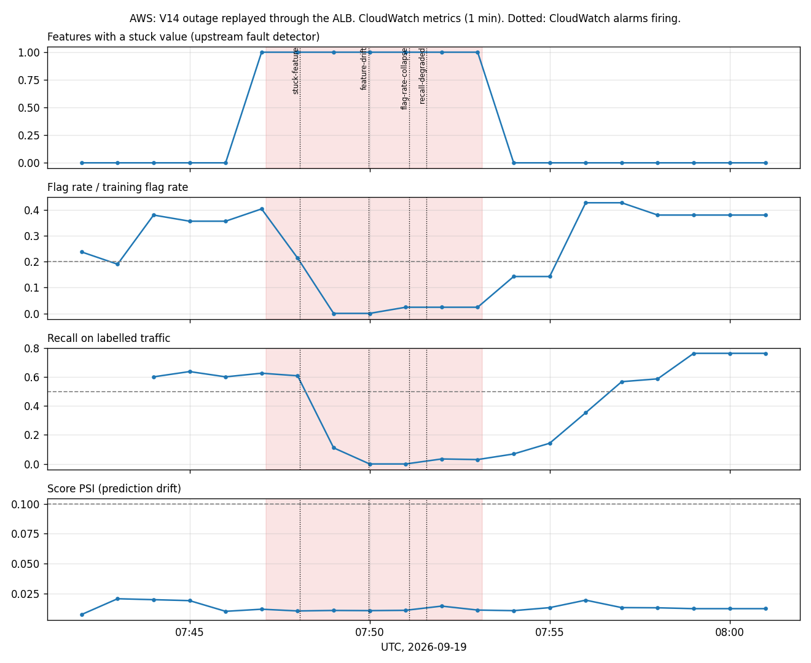

# AWS deployment and results

Deployed with Terraform to a real AWS account in eu-north-1 on 2026-09-19, exercised for about
an hour and a half, then destroyed. Every number here comes from that run; raw data is in
[`docs/aws/`](aws/) and [`loadtest/results/`](../loadtest/results/). The account ID is deliberately
kept out of this repository.

## What Terraform built (56 resources)

| Layer | Resources |
|---|---|
| Network | VPC across 2 availability zones, public subnets, internet gateway, 3 security groups (load balancer, tasks, database), each tier accepting only the tier in front of it |
| Compute | ECS cluster on Fargate: API service (2 tasks, 1 vCPU, 2 GB), drift monitor, auditor; load generator task definition run on demand |
| Traffic | Application Load Balancer: port 80 open only to the operator's IP; port 8080 returns 403 unless a load test token header is present |
| Data | RDS Postgres 16 (db.t4g.micro, encrypted, admin password generated and held by RDS in Secrets Manager); app role password in Secrets Manager |
| Audit | S3 bucket with Object Lock (governance mode, 1 day) holding a write once copy of every seal |
| Images | ECR with immutable tags (the git commit) and scan on push |
| Alerting | 10 CloudWatch alarms (6 model, monitor heartbeat, p99 latency, 5xx rate, unhealthy targets) to an SNS topic |
| Identity | Execution role (pull images, read the two secrets), monitor role (PutMetricData in one namespace), auditor role (put and read seal copies, no delete); the API task has no AWS permissions at all |

Deploying identity: a dedicated IAM user with [`infra/deployer-policy.json`](../infra/deployer-policy.json):
one region, roles and buckets named `fraud-mlops-*` only, roles passable to ECS tasks only.

The migration runs as an **init container** in each API task (`dependsOn: SUCCESS`), behind an
advisory lock so two tasks starting together are safe. Only that container receives the database
admin credentials.

## Results

### Load test from inside the VPC

The generator ran as a Fargate task (2 vCPU, 4 processes) in the same VPC, through the load
balancer, so the numbers exclude home internet latency. Image `5c76c7e`, 2 API tasks.

| Scenario | Throughput | p50 | p99 | Errors |
|---|---|---|---|---|
| single, 1 client | 84 req/s | 12.4 ms | 19.9 ms | 0 |
| single, 8 clients | 234 req/s | 23.1 ms | 89.6 ms | 0 |
| single, 32 clients | 194 req/s | 118 ms | 564 ms | 0 |
| single, 64 clients | 185 req/s | 308 ms | 981 ms | 0 |
| batch of 100, 4 clients | 4,398 rows/s | 67 ms | 224 ms | 0 |
| batch of 1000, 2 clients | 1,844 rows/s | 372 ms | 6,578 ms | 0 |

Single predictions behave like the laptop plus one load balancer hop. Large batches were limited
by the API tasks' CPU (100% during the batch runs; RDS CPU stayed under 20%).

### The V14 drift event, on CloudWatch



132,800 holdout transactions replayed through the load balancer; incident from 07:47:07 UTC.

| Alarm | Fired after incident start | Cleared after recovery start |
|---|---|---|
| stuck-feature | **56 s** | 1 min 56 s |
| feature-drift | 2 min 51 s | 2 min 51 s |
| flag-rate-collapse | 3 min 58 s | 2 min 58 s |
| recall-degraded | 4 min 27 s | 4 min 27 s |
| prediction-drift | **never** (score PSI peaked at 0.0205) | |

No model alarm fired during baseline. CloudWatch is slower than the local Prometheus setup
(recall alert at +150 s locally) because alarms evaluate one minute periods and some need two.

### Tamper test with S3 anchors

Run against RDS with verification executed **inside AWS** as a one off Fargate task (272,061 rows,
37 seals, all 37 copied to Object Lock storage).

| Attempt | Result |
|---|---|
| App role updates a fraud decision | refused: permission denied |
| Database admin updates it | refused: audit table is append only |
| Admin disables the trigger, forges the row and its hash | caught: "seal 37 changed since sealing" |
| Admin also rewrites seal 37 so the database chain is consistent again | database only check **fooled**; S3 comparison catches it: "seal 37 differs from its write once copy" |
| Delete the S3 copy (deployer credentials, no bypass header) | refused: "object protected by object lock" |
| Restore original values | seal 37 verifies again |

### Zero downtime rolling deploy

New image `0674ad2` rolled out while a probe sent continuous `/predict` traffic: **19,076
requests, all 200**. ECS started new tasks, waited for load balancer health checks, then drained
the old ones; the rollout took about 2.5 minutes, with a deployment circuit breaker set to roll
back automatically if new tasks never became healthy.

### Image security scan

| | `5c76c7e` (first deploy) | `0674ad2` (fixed) |
|---|---|---|
| Critical | 2 (curl) | **0** |
| High | 2 (curl, zlib) | 1 (zlib) |
| Medium | 1 (nghttp2) | **0** |

curl was only there for the health check and was replaced with a Python check. The remaining
zlib finding is in the base image's OS package that Python itself needs; security updates were
applied at build time, and it stays open as an accepted risk until Debian ships a fix.

### Audit trail after the sealer fix

After the barrier sealer (see [ISSUES_AND_FIXES.md](ISSUES_AND_FIXES.md#the-sealer-race-rows-appeared-inside-an-already-sealed-range))
was deployed and three high concurrency load runs went through, in-region verification checked
**553,440 rows in 57 seals**. The only problem reported was the historical seal 2 hole from before
the fix. That seal stays flagged: an audit trail records its incident, it does not rewrite history.

## Findings that were not resolved

- **p99 latency spikes under light load.** During the drift replay the API tasks were at 5 to 10%
  CPU and p50 was 14 ms, yet p99 reached 0.2 to 5 s. RDS was **swapping** (up to 148 MB) with
  about 55 MB of free memory, and the prediction log (326 MB) had outgrown Postgres's 180 MB
  cache. The monitor's own queries were fast (12 ms and 141 ms on the server). The likely cause is
  the 1 GB database instance; the direct test, resizing to db.t4g.small, was **refused by the
  account's Free plan**, so this remains a well supported hypothesis, not a proven one.
- **Cost of the auditor on large batches.** Batch throughput was 3,024 rows/s with the auditor off
  and 2,306 rows/s with it on, but each run had about 90 requests and the auditor was still
  clearing a backlog, so the barrier's own cost is not isolated.
- **Cost.** Cost Explorer showed $0.00 on the day because billing data lags up to 24 hours.
  Check with `python scripts/aws.py cost --start 2026-09-19 --end 2026-09-21`.

## Teardown

`python scripts/aws.py empty-seals` (the only way to remove governance locked objects, using the
deployer's bypass permission), then `terraform destroy`: 56 resources destroyed. Independently
checked afterwards: no ECS clusters, RDS instances, load balancers, ECR repositories, VPCs,
secrets, alarms, log groups or Elastic IPs remain, and the seal bucket returns 404.

## Reproduce

```bash
cp infra/terraform/terraform.tfvars.example infra/terraform/terraform.tfvars   # your IP, image tag
terraform -chdir=infra/terraform init
terraform -chdir=infra/terraform apply -target=aws_ecr_repository.api -target=aws_ecr_repository.loadgen
python scripts/aws.py push                                 # prints the image tag
terraform -chdir=infra/terraform apply -var image_tag=<tag>
python scripts/aws.py loadtest                             # in-VPC load test
python scripts/simulate_drift.py --url $(terraform -chdir=infra/terraform output -raw api_url)
python scripts/aws.py alarms --since <start UTC>
python scripts/aws_tamper_demo.py
python scripts/aws.py empty-seals && terraform -chdir=infra/terraform destroy
```
